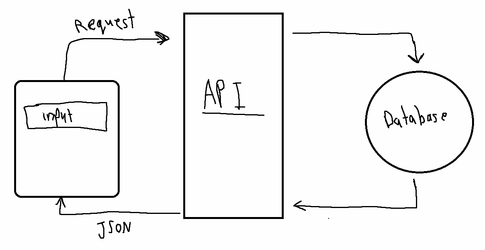

# Project Name

**Author**: Osaid Alhomedy (Aseed Alhameedi)
**Version**: 1.0.0

## Overview

This website will be used to display data about the city or a country that is submitted in the form. It will also display related movies

## Getting Started

1. Go to the provided URL for the website.
2. Enter the city name in the input field.
3. Submit the form and wait for the data to be displayed.

## Architecture

This application uses the following technologies:

1. Javascript
2. ReactJS library.
3. Axios library.
4. Bootstrap framework.
5. NodeJS runtime.
6. ExpressJs.
7. Heroku.
8. Netlify.

## Change Log

## Credit and Collaborations

Abdulqader Al-Omari , Ghadeer Alkhasawneh

## Time Estimates

Name of feature: Back-end development

Estimate of time needed to complete: 2 hours

Start time: 3:00pm

Finish time: 8:00pm

Actual time needed to complete: 5 hours

---

Name of feature: Front-end development

Estimate of time needed to complete: 2 hours

Start time: 10:00pm

Finish time: 2:00am

Actual time needed to complete: 4 hours

---

Name of feature: Refactoring the Back-end code

Estimate of time needed to complete: 1 hours

Start time: 2:00pm

Finish time: 2:30am

Actual time needed to complete: 30 minutes

---

Name of feature: Refactoring the Front-end code

Estimate of time needed to complete: 1 hours

Start time: 12:30pm

Finish time: 1:30am

Actual time needed to complete: 1 hours
